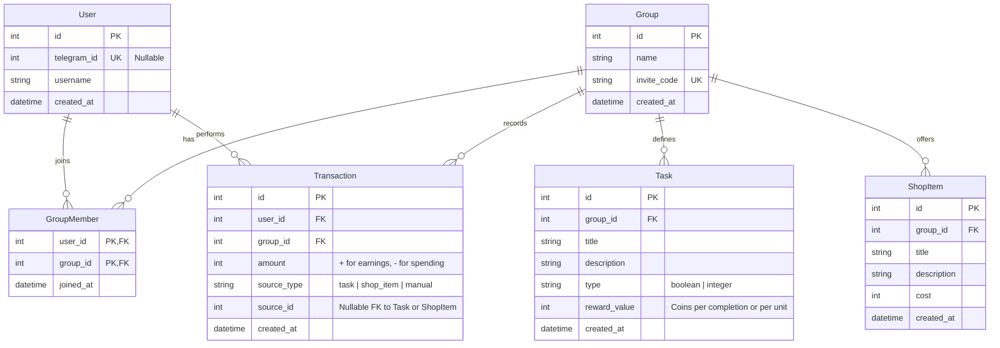

# Architecture Design: Small RPG ADHD Monolith

## 1. Overview
A single-binary Go application combining a Web UI and Telegram Bot to manage a habit-reward system for small groups. The system uses a shared core service layer to ensure business logic consistency across both interfaces.

## 2. Database Schema (SQLite)

We will use SQLite for simplicity and portability.



### SQL Definitions (Draft)

```sql
CREATE TABLE users (
    id INTEGER PRIMARY KEY AUTOINCREMENT,
    telegram_id INTEGER UNIQUE,
    username TEXT NOT NULL,
    created_at DATETIME DEFAULT CURRENT_TIMESTAMP
);

CREATE TABLE groups (
    id INTEGER PRIMARY KEY AUTOINCREMENT,
    name TEXT NOT NULL,
    invite_code TEXT UNIQUE NOT NULL,
    created_at DATETIME DEFAULT CURRENT_TIMESTAMP
);

CREATE TABLE group_members (
    user_id INTEGER,
    group_id INTEGER,
    joined_at DATETIME DEFAULT CURRENT_TIMESTAMP,
    PRIMARY KEY (user_id, group_id),
    FOREIGN KEY(user_id) REFERENCES users(id),
    FOREIGN KEY(group_id) REFERENCES groups(id)
);

CREATE TABLE tasks (
    id INTEGER PRIMARY KEY AUTOINCREMENT,
    group_id INTEGER,
    title TEXT NOT NULL,
    description TEXT,
    task_type TEXT CHECK(task_type IN ('boolean', 'integer')) NOT NULL,
    reward_value INTEGER NOT NULL,
    created_at DATETIME DEFAULT CURRENT_TIMESTAMP,
    FOREIGN KEY(group_id) REFERENCES groups(id)
);

CREATE TABLE shop_items (
    id INTEGER PRIMARY KEY AUTOINCREMENT,
    group_id INTEGER,
    title TEXT NOT NULL,
    description TEXT,
    cost INTEGER NOT NULL,
    created_at DATETIME DEFAULT CURRENT_TIMESTAMP,
    FOREIGN KEY(group_id) REFERENCES groups(id)
);

CREATE TABLE transactions (
    id INTEGER PRIMARY KEY AUTOINCREMENT,
    user_id INTEGER,
    group_id INTEGER,
    amount INTEGER NOT NULL,
    source_type TEXT CHECK(source_type IN ('task', 'shop_item', 'manual')),
    source_id INTEGER,
    created_at DATETIME DEFAULT CURRENT_TIMESTAMP,
    FOREIGN KEY(user_id) REFERENCES users(id),
    FOREIGN KEY(group_id) REFERENCES groups(id)
);
```

## 3. Project Directory Structure

Standard Go project layout adapted for a small monolith.

```text
small-rpg-adhd-monolith/
├── cmd/
│   └── server/
│       └── main.go         # Entry point: initializes DB, Services, Bot, Web Server
├── internal/
│   ├── config/             # Configuration loading (env vars)
│   ├── store/              # Database layer (SQLite implementation)
│   │   ├── sqlite.go       # DB connection
│   │   ├── users.go
│   │   ├── groups.go
│   │   ├── tasks.go
│   │   └── transactions.go
│   ├── core/               # Domain Logic (Service Layer)
│   │   ├── models.go       # Struct definitions
│   │   ├── service.go      # Main Service struct combining sub-services
│   │   └── logic.go        # Business logic (e.g., "CompleteTask", "BuyItem")
│   ├── web/                # Web Interface
│   │   ├── server.go       # HTTP Server setup & Router (chi)
│   │   ├── handlers.go     # HTTP Handlers
│   │   └── middleware.go   # Auth middleware
│   └── bot/                # Telegram Bot
│       ├── bot.go          # Bot setup (telebot)
│       └── handlers.go     # Command handlers (/start, /tasks, etc.)
├── templates/              # HTML Templates
│   ├── layout.html
│   ├── index.html
│   └── ...
├── static/                 # Static assets (CSS, JS, Images)
│   └── style.css
├── go.mod
└── go.sum
```

## 4. Component Design

### Core Service Layer
The `internal/core` package defines the business logic. It is agnostic of the transport layer (Web vs Bot).

**Key Interfaces:**
*   `TaskCompleter`: Handles logic for a user completing a task (validating, creating transaction, updating balance).
*   `ItemPurchaser`: Handles logic for buying an item (checking balance, creating transaction).
*   `GroupManager`: Handles creating groups, generating invite codes, adding members.

### Web UI (`internal/web`)
*   **Framework**: `chi` router.
*   **Rendering**: `html/template`.
*   **Auth**: Simple cookie-based session. For the MVP, maybe just a "Login with Telegram" or a simple dev-login.
*   **Routes**:
    *   `GET /`: Dashboard (User's groups, balances).
    *   `GET /group/{id}`: Group view (Tasks list, Shop).
    *   `POST /group/{id}/task/{taskId}/complete`: Action to complete task.
    *   `POST /group/{id}/shop/{itemId}/buy`: Action to buy item.

### Telegram Bot (`internal/bot`)
*   **Framework**: `telebot` (v3).
*   **Interaction**:
    *   `/start`: Welcome & Login link.
    *   `/tasks`: List available tasks in current group (Inline Buttons to complete).
    *   `/shop`: List shop items (Inline Buttons to buy).
    *   `/balance`: Show current coin balance.
    *   `/newgroup`: Create a new group.

### Dependency Injection
`main.go` will:
1.  Initialize `store` (SQLite).
2.  Initialize `core` services, injecting `store`.
3.  Initialize `bot`, injecting `core`.
4.  Initialize `web`, injecting `core`.
5.  Start Bot (in goroutine) and Web Server.

## 5. Next Steps for Implementation
1.  **Setup**: Initialize `go.mod`, setup `cmd/server/main.go`.
2.  **Store**: Implement SQLite schema migration and basic CRUD.
3.  **Core**: Implement `CompleteTask` and `BuyItem` logic.
4.  **Bot**: Implement basic commands.
5.  **Web**: Implement basic dashboard.